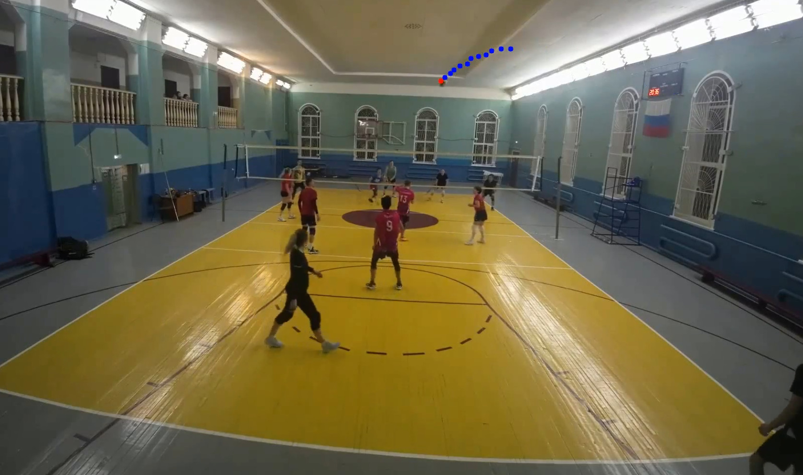

# Fast Volleyball Ball Tracking -> Vertical Reels

## Live demos
- VPS: [Tracking - ball](https://demo.vb-ai.ru/)
- Hugging Face: [Tracking - ball](https://huggingface.co/spaces/asigatchov/volleyball-tracking)

High-speed pipeline for volleyball ball detection, rally extraction, and automatic generation of 9:16 reels.

[](https://www.youtube.com/watch?v=TBDrTMFMoFA)

## Pipeline
1. `src/inference_onnx_seq_gray_v2.py` -> detects ball and writes `ball.csv` (and optional `predict.mp4`).
2. `src/track_calculator.py` -> converts `ball.csv` to rally tracks (`track_*.json`).
3. `src/track_processor.py` -> creates combined video (`combined.mp4`) or split rally clips.
4. `src/make_reels.py` -> creates vertical 9:16 reels centered around ball trajectory.

## Installation
```bash
git clone https://github.com/asigatchov/fast-volleyball-tracking-inference.git
cd fast-volleyball-tracking-inference
uv sync
```

For visualization (using `--visualize` parameter):
```bash
uv sync --extra dev
```

## Quick start (tested)
Example input:
- video: `examples/gtu_20250316_002.mp4`
- model: `models/VballNetV1_seq9_grayscale_330_h288_w512.onnx`

```bash
VIDEO="examples/gtu_20250316_002.mp4"
MODEL="models/VballNetV1_seq9_grayscale_330_h288_w512.onnx"
OUT="output"

# 1) Detection -> ball.csv
uv run src/inference_onnx_seq_gray_v2.py \
  --video_path "$VIDEO" \
  --model_path "$MODEL" \
  --output_dir "$OUT" \
  --only_csv

# 2) Tracks from CSV -> track_*.json
uv run src/track_calculator.py \
  --csv_path "$OUT/gtu_20250316_002/ball.csv" \
  --output_dir "$OUT"

# 3) Optional: combined horizontal rally video
uv run src/track_processor.py \
  --video_path "$VIDEO" \
  --output_dir "$OUT"

# 4) Vertical reels from tracks
uv run src/make_reels.py \
  --video_path "$VIDEO" \
  --json_dir "$OUT/gtu_20250316_002/tracks" \
  --output_dir "$OUT"
```

## Output structure
```text
output/gtu_20250316_002/
├── ball.csv
├── tracks/
│   └── track_0000.json
├── combined.mp4
└── reels/
    └── reel_gtu_20250316_002_0000.mp4
```

## Key CLI options

### `src/inference_onnx_seq_gray_v2.py`
- `--confidence_threshold` - heatmap threshold for detection postprocess.
- `--visualize` - show live preview.
- `--only_csv` - skip writing output video.

### `src/track_calculator.py`
- `--court_json_path` - optional court annotation JSON. If passed, net/court-aware rally filtering is enabled.
- `--fps`, `--max_distance`, `--min_duration_sec` - main tracking/filtering params.

### `src/track_processor.py`
- `--output_dir` - auto-resolves `tracks` and `combined.mp4` by video basename.
- `--json_dir` - explicit tracks folder.
- `--split_dir` - export each rally into a separate clip.

### `src/make_reels.py`
- `--smoothing {none,moving_avg,savitzky_golay,kalman}`
- `--interpolation {hold,linear}`
- `--margin` - lead offset in movement direction.
- `--padding {none,mirror,black}`


## OpenVino runtime
### `uv run src/inference_openvino_seq_gray_v2.py`
- `--model_xml ./ov/VballNetV2_seq9_grayscale_ov.xml`
- `--video_path ./examples/gtu_20250316_002.mp4`
- `--only_csv`
- `--output_dir ./demo-result/`

## Available ONNX models
Benchmark setup:
- runner: `src/inference_onnx_seq_gray_v2.py`
- video: `match9/video/woman_transhmash_2_00004.mp4`
- ground truth: `match9/csv/woman_transhmash_2_00004_ball.csv`
- runtime: local `onnxruntime` on CPU (`CPUExecutionProvider`)
- `Acc@5px (all)` = frame is correct if ball is visible and predicted within 5 px, or if both GT and prediction mark frame as invisible
- `Acc@5px (visible)` = only GT-visible frames are evaluated, prediction must be within 5 px

| Model | FPS | Acc@5px (all) | Acc@5px (visible) |
| --- | ---: | ---: | ---: |
| `VballNetV1_seq9_grayscale_148_h288_w512.onnx` | 138.68 | 87.25% | 86.43% |
| `VballNetV1_seq9_grayscale_204_h288_w512.onnx` | 138.39 | 85.95% | 84.88% |
| `VballNetV2_seq9_grayscale_320_h288_w512.onnx` | 114.22 | 83.01% | 82.56% |
| `VballNetV1_seq9_grayscale_330_h288_w512.onnx` | 141.04 | 82.35% | 81.78% |
| `VballNetV1c_seq9_grayscale_best.onnx` | 142.17 | 76.80% | 74.81% |
| `VballNetGridV1b_seq9_grayscale_20260319_193937.onnx` | 117.55 | 75.49% | 74.03% |
| `VballNetFastV1_seq9_grayscale_233_h288_w512.onnx` | 271.86 | 73.20% | 68.99% |
| `VballNetV1b_seq9_grayscale_best.onnx` | 142.56 | 72.88% | 70.16% |
| `VballNetGridV1c_seq9_grayscale_20260317.onnx` | 185.85 | 64.05% | 62.02% |
| `VballNetFastV1_155_h288_w512.onnx` | 307.56 | 15.03% | 0.00% |
| `VballNetV1_150_h288_w512.onnx` | 149.88 | 10.13% | 0.00% |

## Notes
- `onnxruntime` can run on CPU if CUDA provider is unavailable.
- All scripts support `--help` and can be launched through `uv run`.
